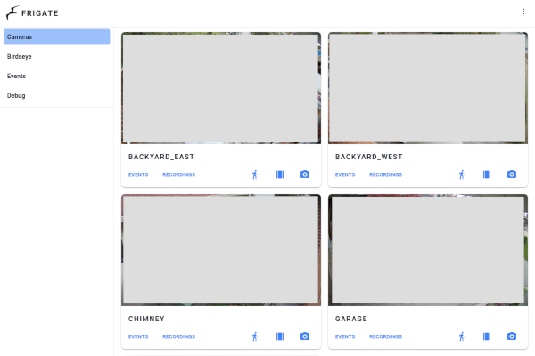

# ansible-role-homeassistant-frigate

An [Ansible](https://www.ansible.com/) role that provisions
[Home Assistant](https://www.home-assistant.io/),
[Frigate](https://github.com/blakeblackshear/frigate), and
[Mosquitto](https://mosquitto.org/)
[Docker](https://docs.docker.com/engine/installation/linux/docker-ce/ubuntu/) containers.

[](https://github.com/andornaut/homeassistant-ibm1970-theme/blob/main/screenshots/light-colors-small.png)
[](./screenshots/frigate.png)

## Hardware

* [Coral.ai USB accelerator](https://coral.ai/products/accelerator/)
* [Home Assistant SkyConnect USB Stick](https://www.seeedstudio.com/Home-Assistant-SkyConnect-p-5479.html)

### [ratgdo](https://paulwieland.github.io/ratgdo/) - Local MQTT & dry contact control of Chamberlain/LiftMaster Security+ 2.0 garage door openers

Getting started

1. Flash the "ratgdo v2.51, Security + 1.0, 2.0 & Dry Contact" firmware using [this webapp](https://paulwieland.github.io/ratgdo/flash.html)
   * The webapp will prompt you to configure WiFi
1. Navigate to the admin web interface
1. Set a MQTT IP and port:1883. You must use an IP not a hostname.
1. Leave the "Home Assistant Discovery Prefix" at its default "homeassistant"
1. Wire the ratgdo to the garage door opener according to [this diagram](https://user-images.githubusercontent.com/4663918/276749741-fe82ea10-e8f4-41d6-872f-55eec88d2aab.png)
1. Navigate to Home Assistant > Settings > Devices & services > Devices and then search for "ratgdo"
1. Add a new card to your dashboard:
   ```
   show_name: true
   show_icon: true
   type: button
    entity: cover.ratgdo_door
   name: Garage Door
   tap_action:
     action: toggle
   show_state: true
   ```

### [SONOFF Zigbee 3.0 USB Dongle Plus](https://itead.cc/product/sonoff-zigbee-3-0-usb-dongle-plus/)

Upgrading SONOFF Zigbee 3.0 USB Dongle Plus (ZBDongle-P) firmware:

* [Instructions for ZBDongle-P](https://sonoff.tech/wp-content/uploads/2023/02/SONOFF-Zigbee-3.0-USB-dongle-plus-firmware-flashing.pdf)
* [How-to: Flashing the firmware via cc2538-bsl](https://www.zigbee2mqtt.io/guide/adapters/flashing/flashing_via_cc2538-bsl.html)
* [How to Use SONOFF Dongle Plus on Home Assistant](https://sonoff.tech/product-review/how-to-use-sonoff-dongle-plus-on-home-assistant-how-to-flash-firmware/)
* [Sonoff Zigbee 3.0 USB Dongle Plus - How to upgrade the firmware (Video)](https://www.youtube.com/watch?v=KBAGWBWBATg)
* [CC1352P2_CC2652P_launchpad_coordinator_20221226.zip firmware](https://github.com/Koenkk/Z-Stack-firmware/raw/master/coordinator/Z-Stack_3.x.0/bin/CC1352P2_CC2652P_launchpad_coordinator_20221226.zip) from [Koenkk@github/Z-Stack-firmware](https://github.com/Koenkk/Z-Stack-firmware)
* [git-developer@github/ti-cc-tool](https://github.com/git-developer/ti-cc-tool) - Docker image for [JelmerT@github/cc2538-bs](https://github.com/JelmerT/cc2538-bsl)

## Configuration

* [Default Ansible variables](./defaults/main.yml)

### Home Assistant

* [Example automation.yaml](./examples/homeassistant/automations.yaml)
* [Example configuration.yaml](./examples/homeassistant/configuration.yaml)

Test configuration
```
docker exec homeassistant hass --config /config --script check_config
docker exec homeassistant hass --config /config --script check_config --secrets
```

### Frigate

* [Example config.yml](./examples/frigate/config.yml)
* [GitHub issue #311](https://github.com/blakeblackshear/frigate/issues/311)

#### Optimizing performance

* [Optimization documentation](https://blakeblackshear.github.io/frigate/configuration/optimizing/)
* [GitHub issue #1607](https://github.com/blakeblackshear/frigate/issues/1607)

##### Gathering information
```
$ vainfo --display drm --device /dev/dri/renderD128
$ ffmpeg -decoders | grep qsv
$ ffmpeg -hwaccels
```

##### Ansible variables
```
# AMD GPU
homeassistant_frigate_env:
    LIBVA_DRIVER_NAME: radeonsi

# Intel CPU
homeassistant_frigate_env:
    LIBVA_DRIVER_NAME: i965
```

##### Monitor GPU usage
```
sudo apt install intel-gpu-tools radeontop
sudo intel_gpu_top
sudo radeontop
```

### Nginx

[ansible-role-letsencrypt-nginx](https://github.com/andornaut/ansible-role-letsencrypt-nginx) variables:

```
# Given:
#homeassistant_port: 8080
#homeassistant_frigate_port: 8081

letsencryptnginx_websites:
  - domain: ha.example.com
    proxy_port: 8080
    websocket_path: /api/websocket
  - domain: frigate.example.com
    proxy_port: 8081
    websocket_enabled: true
```

### HACS installation

* [Documentation](https://hacs.xyz/docs/setup/download):

```
docker exec -ti homeassistant \
    bash -c 'wget -O - https://get.hacs.xyz | bash -'
```

## Troubleshooting

### Neato reauthorization

* [Neato configuration](https://www.home-assistant.io/integrations/neato/#configuration)
* [Home Assistant forums](https://community.home-assistant.io/t/neato-integration-needs-to-be-reconfigured-after-updating-ha-from-2020-12-1-to-2021-1-1/266345/22)

The Neato integration can sometimes report this error:

> Failed to set up: Token not valid, trigger renewal

When this occurs, click the "Reconfigure" button in Home Assistant `/config/integrations`,
which will start a new authorization flow with Neato.
The reauthorization flow may trigger this error:

> The redirect uri included is not valid.

If that occurs, then ensure that the "Redirect URI" of the "application" configured in
[the Neato developers portal](https://developers.neatorobotics.com/applications)
points to `https://my.home-assistant.io/redirect/oauth`,
and ensure that [https://my.home-assistant.io/](https://my.home-assistant.io/)
is configured to point to your Home Assistant `external_url`,
which you can do by [navigating to it](https://my.home-assistant.io/) and submitting the form.

n.b. If you've deleted and re-created a new "application" in the Neato developer portal,
then be sure to update the client_id and client_secret in `secrets.yaml`.

### iRobot Roomba J7 cloud password

Get the cloud password (authn/z token):
```
docker run -it node sh -c "npm install -g dorita980 && get-roomba-password-cloud ${websiteEmail} ${websitePassword}
```

### Sensi Thermostat HomeKit

* [/r/homeassistant/ post](https://github.com/andornaut/ansible-role-homeassistant-frigate/edit/main/README.md)

1. Reset the thermostat to factory settings
1. Begin the thermostat setup process via the Sensi app
1. Prior to configuring WIFI, the thermostat will display a pairing code - take note of this.
1. Continue with the setup process via the Sensi app, but switch to Home Assistant once you've connected the thermostat to WIFI
1. Home Assistant should now detect a new HomeKit device, which you should begin configuring
1. When prompted for a "pairing code", enter the code noted above, and then complete the setup procedure
1. Complete the Sensi app setup procedure

### Upgrade, downgrade or pin a component's dependencies

Eg. Pin [pyenvisalink](https://github.com/Cinntax/pyenvisalink)
to version 4.0 to workaround
[this issue](https://github.com/home-assistant/core/issues/65762#issuecomment-1030872475).

```
docker exec -ti homeassistant \
    bash -c "find /usr/src/homeassistant/ \
    -name 'requirements*.txt' -or -name manifest.json \
    | xargs grep -l pyenvisalink \
    | xargs sed -i 's/pyenvisalink==[a-zA-Z0-9.]\+/pyenvisalink==4.0/g'"
```

Or upgrade the offending dependency directly as in these Ansible tasks:

```
- name: "Install pexpect from the 'master' branch. Workaround 1/2 for: https://github.com/home-assistant/core/issues/94264"
  community.docker.docker_container_exec:
    container: homeassistant
    argv:
      - /bin/bash
      - "-c"
      - "pip install https://github.com/pexpect/pexpect/archive/master.zip"

- name: "Restart the homeassistant container. Workaround 2/2 for: https://github.com/home-assistant/core/issues/94264"
  community.docker.docker_container:
    name: homeassistant
    state: started
    restart: true
```

### Coral.ai doesn't work

* [Failed to load delegate from libedgetpu.so.1.0](https://github.com/blakeblackshear/frigate/issues/3259)

`docker logs frigate` shows an error:

> ValueError: Failed to load delegate from libedgetpu.so.1.0

Try rebooting the host OS or restarting the Docker container.

When debugging, note that when a Coral.ai USB adpater is first connected its manufacturer is listed as "Global Unichip Corp",
[but then it changes](https://github.com/google-coral/edgetpu/issues/536) to "Google Inc." after its first inference, so look for both manufacturer names: `lsusb | grep -E 'Global|Google'`

Excerpt from dmesg:
```
[  303.677695] usb 3-2: new high-speed USB device number 22 using xhci_hcd
[  303.827453] usb 3-2: New USB device found, idVendor=1a6e, idProduct=089a, bcdDevice= 1.00
[  303.827457] usb 3-2: New USB device strings: Mfr=0, Product=0, SerialNumber=0
[  334.017843] usb 3-2: reset high-speed USB device number 22 using xhci_hcd
[  336.329848] usb 3-2: reset high-speed USB device number 22 using xhci_hcd
[  336.478836] usb 3-2: device firmware changed
[  336.478857] usb 3-2: USB disconnect, device number 22
[  336.606068] usb 3-2: new high-speed USB device number 23 using xhci_hcd
[  336.755606] usb 3-2: New USB device found, idVendor=18d1, idProduct=9302, bcdDevice= 1.00
[  336.755611] usb 3-2: New USB device strings: Mfr=0, Product=0, SerialNumber=0
```

## Documentation and resources

* [BurningStone91's smart home setup](https://github.com/Burningstone91/smart-home-setup/)
* [FFmpeg QuickSync](https://trac.ffmpeg.org/wiki/Hardware/QuickSync)
* [FFmpeg VAAPI](https://trac.ffmpeg.org/wiki/Hardware/VAAPI)
* [Frigate machine learning accelerator by Coral](https://coral.ai/products/)
* [Frigate mobile app notifications blueprint](https://community.home-assistant.io/t/frigate-mobile-app-notifications/311091)
* [Home Assistant automation trigger variables](https://www.home-assistant.io/docs/automation/templating/)
* [Home Assistant script syntax](https://www.home-assistant.io/docs/scripts/)
* [IBM1970 theme](https://github.com/andornaut/homeassistant-ibm1970-theme)
* [Material icons](https://materialdesignicons.com/) - Customize Home Assistant icons. Prefix with "mdi:".
* [Mosquitto](https://mosquitto.org/) - MQTT message broker
* [SgtBatten's HA blueprints](https://github.com/SgtBatten/HA_blueprints)

### Custom cards

* [Bubble Card](https://github.com/Clooos/Bubble-Card)
* [Button card](https://github.com/custom-cards/button-card/)
* [Frigate Lovelace card](https://github.com/dermotduffy/frigate-hass-card)
* [Layout card](github.com/thomasloven/lovelace-layout-card)
* [Mini media player](https://github.com/kalkih/mini-media-player)
* [Slider entity row](https://github.com/thomasloven/lovelace-slider-entity-row/)

### Integrations

* [Amcrest](https://www.home-assistant.io/integrations/amcrest/)
* [Denon AVR](https://www.home-assistant.io/integrations/denonavr/)
* [Ecobee](https://www.home-assistant.io/integrations/ecobee/)
* [Elgato Light](https://www.home-assistant.io/integrations/elgato/)
* [Envisalink](https://www.home-assistant.io/integrations/envisalink/)
* [Foscam](https://www.home-assistant.io/integrations/foscam/)
* [Google Cast](https://www.home-assistant.io/integrations/cast/)
* [Govee](https://github.com/LaggAt/hacs-govee)
* [HomeKit](https://www.home-assistant.io/integrations/homekit/)
* [Neato](https://www.home-assistant.io/integrations/neato/)
* [Roborock](https://www.home-assistant.io/integrations/roborock/)
  * [humbertogontijo/homeassistant-roborock](https://github.com/humbertogontijo/homeassistant-roborock)
  * [pfsense Nat 1:1 workaround](https://github.com/rytilahti/python-miio/issues/422#issuecomment-573408811)
  * [Xiaomi-cloud-tokens-extractor](https://github.com/PiotrMachowski/Xiaomi-cloud-tokens-extractor)
* [Roomba](https://www.home-assistant.io/integrations/roomba/)
  * [SDK](https://github.com/koalazak/dorita980)
* [Ruckus Unleashed](https://www.home-assistant.io/integrations/denonavr/)
* [Zigbee Home Automation](https://www.home-assistant.io/integrations/zha/)

#### Custom integrations

* [Bambu Lab](https://github.com/greghesp/ha-bambulab)
* [Frigate](https://github.com/blakeblackshear/frigate-hass-integration)
* [Meross](https://github.com/albertogeniola/meross-homeassistant)
* [Roborock](https://github.com/humbertogontijo/homeassistant-roborock)
* [Sensei Thermostat](https://github.com/iprak/sensi)
* [Simpleicons](https://github.com/vigonotion/hass-simpleicons)
